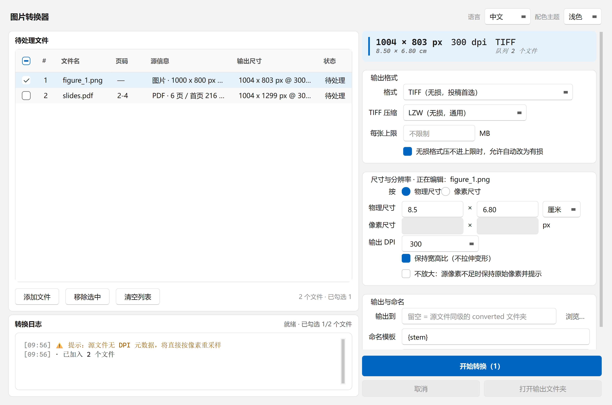
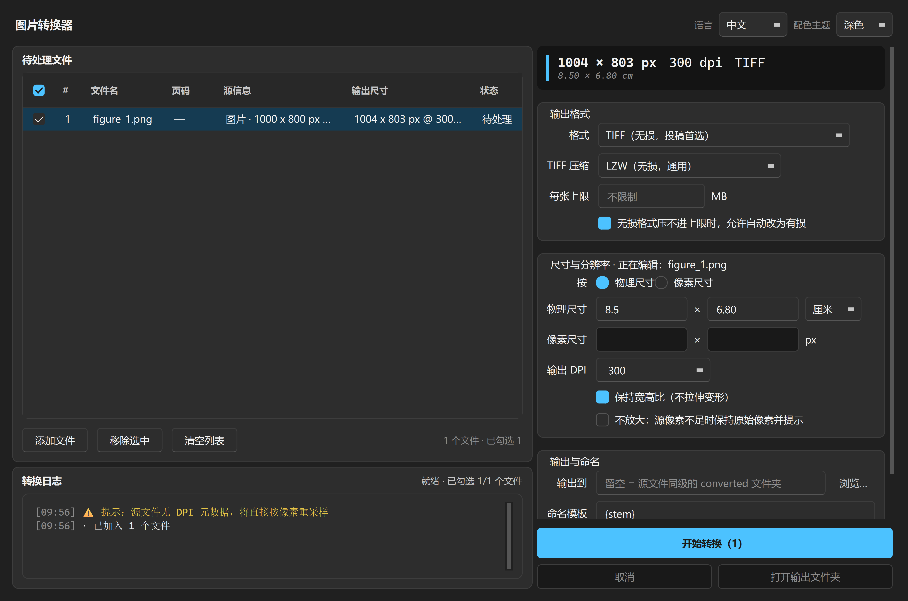

# 图片转换器 —— 科研投稿图片规格化

[](https://github.com/Tumu-Zhang/imgspec/actions/workflows/ci.yml)
[](LICENSE)


**Normalize research figures to journal specs: fixed DPI, fixed physical size, fixed format.**
Batch-convert PPT/PPTX, PDF, SVG and raster images — GUI + CLI, Windows.

把「原始素材」变成「期刊能收的图」：**固定 DPI、固定物理尺寸、固定文件格式**。

支持 PPT/PPTX、PDF 和常见图片格式，拖进去、设好参数、批量出图。

全过程是纯几何与编码变换 —— 矢量重渲染 + 重采样 + 元数据写入，
**不做任何 AI 重绘或图像生成**，结果与 Photoshop 的「图像大小 + 另存为」等价，
只是可以批量、可复现、可脚本化。

**👉 [下载 Windows 绿色版（免安装，解压双击即用）](https://github.com/Tumu-Zhang/imgspec/releases/latest)👈**

| 浅色主题 | 深色主题 |
|---|---|
|  |  |

---

## 快速开始

### 方式一：下载绿色版（推荐，不需要装 Python）

到 [**Releases**](https://github.com/Tumu-Zhang/imgspec/releases/latest) 下载
`imgspec-v*-win64.zip`，解压后双击 **`图片转换器.exe`** 即可 —— 不用装 Python，
不用编译，解压就能用。

这是一个绿色软件，整个文件夹可以拷到任何 Windows 电脑上用，
包括没有装 Python 的电脑 —— 拷给同组同事也能直接跑。

> 要一起带走的是 `图片转换器.exe` 和同级的 `_internal\` 文件夹，两者缺一不可
> （后者是运行库）。想放桌面的话，右键 exe → 发送到 → 桌面快捷方式即可。
> 首次运行若被 SmartScreen 拦截：点「更多信息 → 仍要运行」（程序未做代码签名）。

### 方式二：从源码运行（需要 Python 3.10+）

源码在 `生产部/` 目录，先进去再装依赖：

```bash
cd 生产部
pip install -r requirements.txt

# 图形界面
python -m gui

# 命令行（适合把规格固化进投稿流程）
python -m imgspec figure.pdf --width 8.5 --unit cm --dpi 300 --format tiff
```

Windows 上也可以双击 `生产部\run_gui.bat`（会自动检查并安装依赖）。

### 确认它能用：自检

打包版和源码版都支持一次真实的自检 —— 它会生成测试图、按规划转换、读回校验像素与 DPI：

```bash
图片转换器.exe --selftest      # 源码方式：进 生产部/ 后 python -m imgspec.selftest
```

还可以把你手上任何一个文件交给它试跑一遍，确认这类文件能不能处理
（PPT/PPTX 走的是 Office 自动化，是最值得先确认的一条链路）：

```bash
图片转换器.exe --selftest "D:\论文\Figure1.pptx"
```

结果同时写进 `%TEMP%\imgspec_selftest_report.txt`（双击运行的 exe 没有控制台，
所以以这个文件为准）。自检也会报告本机 PowerPoint 是否可用于转换幻灯片。

---

## 它解决什么问题

| 期刊要求 | 你提供的 |
|---|---|
| 「图宽 8.5 cm，300 dpi」 | 宽度 `8.5`、单位 `cm`、DPI `300` |
| 「2550 × 3300 px」 | 切到像素模式，填 `2550 × 3300` |
| 「TIFF，LZW 压缩」 | 格式选 TIFF，压缩选 LZW |
| 「单图不超过 10 MB」 | 体积上限填 `10` MB |
| 「PPT 里的图要单独出图」 | 直接拖入 PPTX |
| 「只要 PDF 的第 3 页」 | 在文件列表的「页码」列双击填 `3` |

---

## 支持的输入

| 类型 | 扩展名 | 处理方式 |
|---|---|---|
| 幻灯片 | `.ppt` `.pptx` `.pptm` `.pps` `.ppsx` | 由本机 PowerPoint 导出为 PDF，再按目标 DPI 矢量重渲染 |
| PDF | `.pdf` | PyMuPDF 按目标 DPI 矢量重渲染，逐页输出 |
| 矢量图 | `.svg` | MuPDF 直接解析并按目标 DPI 渲染（**无需装任何外部工具**） |
| 图片 | `.png` `.jpg` `.tif` `.bmp` `.gif` `.webp` `.jp2` `.ppm` `.tga` 等 | 直接高质量重采样 |

一份文件可能出多张图：多页 PDF / 多页幻灯片会**逐页输出**，
命名自动加 `_p01` `_p02` 后缀（可用命名模板改写）。

只要源文档是多页的，即使你只挑了其中一页，输出也会保留页号
（从 10 页 PDF 里取第 3 页得到 `doc_p03.tif`，而不是 `doc.tif`），
避免把第 3 页的东西误认成第 1 页。

---

## 界面怎么用

顶部一条窄栏放应用名与**语言、主题切换框**（下拉框，靠右上角）；
主体是左右两栏：**左栏**是文件队列与转换日志，**右栏**是参数面板。

左栏的文件列表带**勾选框与序号**：新加入的文件默认全选，
表头第一格是全选开关（支持半选状态）；PDF / PPT 的行多一列可编辑的**页码**，
双击即可填 `1,3-5` 这样的范围，其余文件不受影响 —— 不用为了取几页而单独走一遍设置。
列表下方的按钮行从左到右是**添加文件 → 移除选中 → 清空列表**，第一次使用直接点「添加文件」。

右栏自上而下按归属分成三组，最底部固定着转换按钮：

- **输出格式**：格式下拉框；**TIFF 压缩、JPEG 质量只在选中对应格式时出现**；
  每张图的**体积上限（MB）与有损降级**也放在这里 —— 它们本来就和编码是一件事
- **尺寸与分辨率**：物理尺寸 / 像素尺寸两种模式、DPI、宽高比与放大策略
- **输出与命名**：输出目录、命名模板、重名处理

1. 把文件**拖到窗口任意位置**（文件夹也可以，会递归展开）
2. 在右栏设参数，它顶部的**规格条**会实时显示每张图最终会变成多少像素、多少 dpi
3. 点「开始转换（已勾选数）」—— 只转换列表里勾选的文件

**尺寸参数按行编辑**：右栏的尺寸与分辨率面板编辑的是**当前选中的行**
（标题会显示「正在编辑：文件名」），新加入的文件沿用当前参数作为起点 ——
想给同批文件各设不同尺寸，点选某行直接改即可；按住 Ctrl/Shift 多选几行再改，
参数会**批量应用**到所有选中行。勾选决定「转哪些」，点选决定「编辑谁」。

勾选「保持宽高比」后，宽高两框**始终都有值**：空的一边会立即按源图比例补上；
之后修改任何一边，另一边都会**按比例自动联动**（像素与物理尺寸都生效）。
此时你改的那条边就是**硬约束** —— 比如把宽度改成 8.5 cm，同批所有文件
（不管横图竖图还是竖版 PDF）的输出宽度都精确等于 8.5 cm，高度各按自己的比例；
取消「保持宽高比」时则要求宽高都填，按填入值精确拉伸。

界面上的参数会自动记住，下次打开还是上次的设置。
转换过程中可以随时取消 —— 取消在文件边界生效，当前文件会处理完再停。
进度条与实时状态显示在**转换日志卡片的标题栏**；日志按级别着色并带 ✓ / ⚠ / ✗ 前缀。

转换结束后，窗口右下角会浮出一张**完成通知**：全部成功时几秒后自动淡出，
有失败时则停在那里等你确认，上面可以直接点「打开输出文件夹」。

界面支持**中英文**：右上角的语言下拉框切换，切换后整个窗口立即重建为新语言。

### 输出目录完全由你控制

右栏 **「输出与命名」** 组里集中了输出落盘的全部选项：

| 你怎么填 | 结果 |
|---|---|
| **留空** | 输出到**每个源文件自己所在的目录**下的 `converted\` 子文件夹 |
| 点「浏览…」选一个目录 | 所有图都输出到那一个目录 |
| 直接粘贴/输入路径 | 同上；路径不存在会自动创建 |

同一组里还有：

- **命名模板**：输出文件名，默认 `{stem}`。可用变量 `{stem}`（源文件名）、`{page}`（页号）、
  `{index}`；鼠标停在输入框上会显示说明。例：填 `{stem}_300dpi` 得到 `fig_300dpi.tif`

- **重名处理**：默认 **`自动改名`** —— `fig.tif` 已存在就输出 `fig_1.tif`、`fig_2.tif`…
  **既不会失败，也不会覆盖你已有的文件**。也可以改成「覆盖」或「跳过」

- **体积上限**在上一组 **「输出格式」** 里：单图体积上限（MB），
  压不进时按「有损降级」策略处理并提示

所有设置都会被记住，下次打开还是上次的。转换完点完成通知或动作区的「打开输出文件夹」直接跳过去。

---

## 几个需要理解的语义

### 尺寸的两种模式

- **物理尺寸**：填 8.5 cm + 300 dpi → 像素 = 8.5 ÷ 2.54 × 300 = 1004 px。
  勾选「保持宽高比」时你改的那条边是**硬约束**（宽度 8.5 cm 对所有文件都精确成立，
  另一边各按源比例）；命令行里宽高同时给出且勾选等比时是**等比内接**
  （不会超出、不会变形）；取消等比时宽高都必填，按值精确拉伸。
- **像素尺寸**：直接指定像素数，DPI 写进文件头，物理尺寸由两者反推。

> 宽高各自独立取整，所以 8.5 cm 这类除不尽的值会带来不到 0.1% 的比例偏差 ——
> Photoshop 也一样，这是整数像素的必然结果。

### 「不放大」

勾选后，源图像素不足以支撑目标尺寸时**不会插值放大**，而是保持原始像素输出，
并在日志里告诉你实际物理尺寸变成了多少。

放大只会产生假细节，期刊审稿人看得出来。这个开关让这类问题无处藏身。

### 体积上限

按这个顺序尝试，每一步都会在日志里说明：

1. 按你设的参数直接编码，达标就结束
2. 无损格式压不进时，先在**无损档位之间**换（TIFF：LZW ↔ Deflate）
3. 还不行，且你允许有损时，才退到有损（TIFF 内嵌 JPEG / 降低 JPEG 质量），
   **二分搜索满足上限的最高质量**
4. PNG 是无损格式，压不进去就如实报告，不会偷偷换成 JPEG

默认允许有损兜底，可以在界面或命令行关掉 —— 关掉后压不进上限就直接报错。
**任何降质都会在结果里明确写出来，不会静默发生。**

### 内嵌位图的有效分辨率检查

PDF/PPT 里的图片是位图，不是矢量。导出的 PDF 页面在 600 dpi 下渲染，
不代表页面里的截图真的有 600 dpi 的细节。

工具会测量每页内嵌位图的实际有效分辨率，低于目标 DPI 时给出警告，例如：

```
⚠ 第 1 页内嵌位图的有效分辨率仅约 133 dpi，低于目标 300 dpi。
  放大不会产生新细节，建议改为用矢量源或提高原始截屏分辨率。
```

---

## 为什么 PPT 需要 Microsoft PowerPoint

`python-pptx` 只能读结构，**无法渲染页面**。要得到与「PowerPoint 另存为图片」
一致的结果，必须驱动 PowerPoint 本体。

工具用 `DispatchEx` 启动一个**独立实例**，不会干扰你正在编辑的文稿；
源文件以只读方式打开，导出到临时位置。没装 PowerPoint 时会给出明确提示，
而不是静默产出一张空白图。

转换结束后，工具会**结束这个自己启动的 PowerPoint 进程**，而不是等它优雅退出。
这是实测后的取舍：`Quit()` 要 16 秒，之后释放 COM 代理还要约 60 秒，合计 76 秒
全部卡在调用线程里；而 `DispatchEx` 保证它与用户正在编辑的 PowerPoint 是两个
独立进程，我们只让它只读导出、从不修改任何文稿，所以直接终止它是安全的，
也不会触发「上次异常退出」的文档恢复提示。

本机没有 PowerPoint 时的替代做法：在 PowerPoint 里「另存为 PDF」，再把 PDF 拖进来。

---

## 命令行

> 源码方式运行：先 `cd 生产部`。

```
python -m imgspec <文件或目录>... [选项]

尺寸（物理与像素二选一）
  --width / --height / --unit {mm,cm,inch}
  --px-width / --px-height
  --no-aspect            取消等比，精确拉伸
  --no-upscale           源像素不足时不放大

输出
  --dpi 300
  --format {tiff,png,jpeg,pdf}
  --out DIR              默认源文件同级 converted/
  --name "{stem}"        可用 {stem} {page} {index}
  --pages "1,3-5"
  --on-conflict {rename,overwrite,skip}

编码
  --tiff-compression {lzw,deflate,none}
  --jpeg-quality 95
  --limit 10             单张上限（MB）
  --no-lossy-fallback    禁止降为有损

其他
  --dry-run              只预览尺寸结果，不写文件
  --quiet
```

常用例子：

```bash
# 先看看会输出成什么，不写文件
python -m imgspec *.pdf --width 8.5 --unit cm --dpi 300 --dry-run

# 17 cm 宽、600 dpi、TIFF，单图不超过 10 MB
python -m imgspec figures/ --width 170 --unit mm --dpi 600 --limit 10

# 幻灯片只要第 2 页，出 PNG
python -m imgspec slides.pptx --px-width 2550 --dpi 300 --format png --pages 2
```

---

## 界面设计

定下来的方向是 **Windows 11 Fluent**：柔和的分层背景（窗口灰 + 纯白/深灰卡片）、
克制的系统蓝强调色、8px 卡片圆角与更淡的边框。这是 Windows 桌面生产力工具，
与系统观感一致比自创风格更重要；浅深双主题都完整支持，并跟随 Windows 系统设置。
（设计方法参考了 `anthropics/skills` 的 frontend-design，Apache-2.0。）

- **布局按动线走**：左栏是工作内容（文件队列 + 转换日志），右栏按归属分组放参数。
  改一下参数、上面的规格条立刻显示会产出什么、底部按钮就在手边 —— 一列走完。
- **主按钮永远可见**：右栏底部的动作区固定不滚动，参数再多也不会把「开始转换」挤出视野。
- **设置按归属就地安放**：TIFF 压缩 / JPEG 质量跟随所选格式动态出现，
  体积上限与编码同组，输出目录、命名与重名处理自成一组 ——
  界面上只看见与当前选择有关的选项，也不用到处找设置入口。
- **反馈分层次**：输入框聚焦走 Fluent 的底部强调线；按钮悬停只轻微变背景，不抢注意力；
  转换完成用**非模态浮层通知**，成功自动淡出、有失败才驻留，不打断继续操作。
- 技术读数（像素、dpi、体积）用等宽字体，因为这些数字需要**列对齐**才有用。
- 间距统一走 **4px 网格**（见 `theme.SPACE_*`），界面节奏才稳。
- 配色、字体、间距都集中在 `gui/theme.py` 一个文件，改主题不用翻界面代码；
  界面文案集中在 `gui/i18n.py`，中英双语一键切换。

> 初版曾走「印刷校样台」方向（顶部规格条作为全窗口唯一深色块）—— 那个意象本身
> 站得住，但参数被挤在右下角、底部还压着一条输出设置条，设置与预览离得太远。
> 改版把参数收进右侧固定栏、「输出与命名」并入同一列，只保留规格条这一个深色锚点。
> 本轮再改：输入区加勾选与逐文件页码、进度条并入日志卡片；
> 再把设置弹窗拆散回对应功能区（编码与体积归格式组、输出与命名回归右栏），
> 语言与主题改成右上角下拉框，「添加文件」落到输入区按钮行。

---

## 项目结构

仓库按「四部门管线」组织：

```
生产部/          软件本体：代码、测试、打包与发布工具
  main.py         exe 与双击运行的入口（含 --selftest）
  gui/
    theme.py       调色板、字体、样式表、自绘应用图标
    i18n.py        中英双语文案表
    widgets.py     可复用小组件（完成通知浮层、全选表头）
    main_window.py 拖拽、文件队列（勾选/页码）、参数栏、后台转换
    worker.py      后台转换线程
  imgspec/
    model.py      输出规格与几何解析（尺寸、等比、单位换算）
    ingest.py     输入探测（类别、页数、源分辨率），不启动 Office
    office.py     PowerPoint 自动化（唯一依赖 Office 的模块）
    render.py     矢量页按目标 DPI 光栅化 + 栅格图重采样
    encode.py     编码与体积控制（TIFF LZW / PNG / JPEG / PDF）
    pipeline.py   批量编排、命名、冲突处理
    selftest.py   自检：跑一次真实转换并校验结果
    cli.py        命令行入口
  tools/
    make_icon.py        生成 icon.ico
    build.py            一键打包（含依赖排除与收尾）
    make_installer.py   制作安装包（调用 Inno Setup）
  installer/
    图片转换器.iss      安装脚本：名称、版本、目录、快捷方式、卸载入口
    README.md           文件清单、运行时处理与验证步骤
  tests/          pytest 测试
宣传部/          宣传素材：界面截图、打赏收款码、Logo 与品牌规范
反馈部/          用户反馈的收集与处理流程
组织部/          管线规则：部门职责、工作流、版本与发布规范（PIPELINE.md）
```

## 重新打包

需要改代码再打包时，一条命令即可（参数都固化在脚本里，不用记那串排除列表）：

```bash
cd 生产部
python tools\build.py
```

它会完成：生成图标 → 调用 PyInstaller → **把 exe 和运行库从 `dist\` 提到 `生产部\`**
（软件所在目录，打开就能看到 exe）→ 打印体积与入口路径。

> 打包时会排除环境里装着的 `torch` / `pyarrow` / `scipy` / `pandas` 等无关的大包 ——
> 它们不是本工具的依赖，但 PyInstaller 会顺着可选导入把它们整个拖进来（光是 torch
> 就有 364 MB，排除后产物体积从 848 MB 降到约 206 MB）。

## 制作安装包

上面的 `tools/build.py` 产出的是**绿色版**：`图片转换器.exe` + `_internal\`，
整个拷走就能用。要发给别人时，可以再包成一个有安装向导、开始菜单项和卸载入口的
**安装程序**：

```bash
cd 生产部
python tools\make_installer.py
```

产物在 `生产部\dist\installer\`，两种都出：

- `图片转换器-<版本>-当前用户-setup.exe` —— 免管理员，双击即装（发给同事用这个）
- `图片转换器-<版本>-所有用户-setup.exe` —— 需管理员，适合机房统一部署

需要本机装 [Inno Setup 6](https://jrsoftware.org/isdl.php)（约 5 MB），
且要先跑过 `python tools/build.py`。

> **未签名的安装包在别人机器上会被 SmartScreen 拦截**，首次运行需点
> 「更多信息 → 仍要运行」。发的时候记得一并说明。

文件清单、运行时依赖处理与验证步骤见 `生产部/installer/README.md`。

## 测试

```bash
cd 生产部
python -m pytest tests/ -q
```

覆盖几何解析、各格式编码与体积控制、多页 PDF/页码、命名与冲突策略、
批量容错与取消、命令行与界面闭环。

---

## 已知限制

- **不放大**的判断只对光栅源有意义；矢量页可以任意放大（但页内位图会被检查并提示）。
- 高位深与色彩：TIFF 保留 16 位灰度原样；JPEG 会按「高字节」降到 8 位并提示。
  首版不做 CMYK 与 ICC profile 嵌入。
- 多帧文件（GIF/多页 TIFF）只处理第 1 帧。
- EPS / AI / CDR 等需要外部渲染器的格式仍不受支持（EPS 要 Ghostscript），
  工具会给出明确的转换建议而不是静默失败。**SVG 已支持**，无需外部依赖。
- PNG 的 DPI 存在 pHYs 块（单位「像素/米」），300 dpi 只能表示为 299.9994 ——
  这是 PNG 格式的固有精度，Photoshop 导出的 PNG 也一样；TIFF 与 JPEG 是精确的。
- `--limit` 与体积搜索会多次编码同一张图，超大图（上亿像素）时较慢。

---

## 问题反馈

遇到 bug 或有功能建议，欢迎到 [Issues](https://github.com/Tumu-Zhang/imgspec/issues) 提交 ——
模板会引导你填版本号与复现步骤，附上「转换日志」卡片里的内容能更快定位。
反馈的处理流程见 [反馈部/README.md](反馈部/README.md)。

---

## License

[MIT](LICENSE) © 2026 Tumu-Zhang

## 请作者喝杯咖啡

如果这个工具帮你省下了改图的时间，欢迎请作者喝杯咖啡 ☕
打赏全凭自愿、金额不限 —— 给仓库点个 **Star** 就是最大的支持！

| 微信 | 支付宝 |
|---|---|
|  |  |

